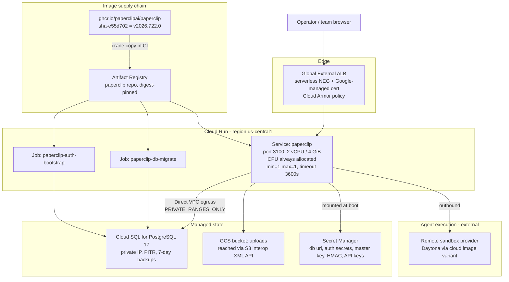

# Paperclip on GCP Cloud Run — Architecture & Deployment Plan

> **Superseded as the working plan.** Start at [`STATUS.md`](../../STATUS.md) and
> [paperclip-cost-optimized-execution.md](paperclip-cost-optimized-execution.md).
> This file is background (how Paperclip behaves on Cloud Run). Do not treat it
> as the task list.

Status: Plan only. Nothing implemented.
Date: 2026-08-03
Target: `paperclipai/paperclip` @ `v2026.722.0` (latest stable release, published 2026-07-22)
Decisions taken: **stateless Cloud Run** + **control-plane-only agent execution**

---

## 1. What Paperclip Actually Is (findings from repo inspection)

Paperclip is not a stateless web app. It is an agent-orchestration control plane: a
Node/Express server that serves a built React UI, owns a PostgreSQL schema via Drizzle,
runs an in-process scheduler that wakes agents, and — in its default self-hosted shape —
spawns coding-agent CLIs as child processes inside its own container.

### 1.1 Deployment model

Two runtime modes, from `doc/DEPLOYMENT-MODES.md`:

- `local_trusted` — no login, loopback bind only.
- `authenticated` — Better Auth sessions, with exposure `private` or `public`.

For an internet-facing Cloud Run service the only valid combination is
`authenticated` + `public`. That combination enforces:

- an explicit public URL (`PAPERCLIP_PUBLIC_URL`) is required
- Better Auth request rate limiting is **on** by default
- browser-based first-admin claim is **disabled** (see risk R1)
- local stdio MCP runtime slots fail closed unless `PAPERCLIP_TRUSTED_MCP_RUNTIME_HOST` is set

Bind is a separate concern from auth. `resolveRuntimeBind` in
[`packages/shared/src/network-bind.ts`](https://github.com/paperclipai/paperclip/blob/v2026.722.0/packages/shared/src/network-bind.ts)
maps `bind=lan` to `0.0.0.0`, and `inferBindModeFromHost("0.0.0.0")` returns `lan`.
The Docker image already sets `HOST=0.0.0.0`, so it binds correctly on Cloud Run with no
extra configuration. `bind=tailnet` is the only mode rejected for `public` exposure.

### 1.2 Dockerfile

Four-stage multi-stage build (`base` → `deps` → `build` → `production`), plus a
`cloud` stage. Key facts:

- Base image `node:lts-trixie-slim`; pnpm via corepack; pnpm workspace monorepo
  (`cli`, `server`, `ui`, `packages/*`).
- The `production` stage globally installs four agent CLIs —
  `@anthropic-ai/claude-code`, `@openai/codex`, `opencode-ai`, `@google/gemini-cli` —
  plus `git`, `gh`, `ripgrep`, `python3`, `jq`, `openssh-client`. This is why the image
  is large.
- `ENTRYPOINT ["docker-entrypoint.sh"]`, `CMD ["node", "--import", "./server/node_modules/tsx/dist/loader.mjs", "server/dist/index.js"]`.
- The entrypoint remaps the `node` user's UID/GID and runs a **recursive `chown` over
  `$PAPERCLIP_HOME`** when it finds any file not owned by `node`, then drops privileges
  via `gosu`. This is the reason GCS FUSE was rejected as a volume backend.
- A separate `cloud` target adds built sandbox-provider plugins (currently `daytona`)
  for managed deployments. This is the target we want for remote agent execution.

Image facts verified against the registry:

- `ghcr.io/paperclipai/paperclip` publishes only `latest`, `latest-cloud`,
  `buildcache*`, and `sha-<short>` tags. **There are no version tags on GHCR.**
- `sha-e55d702` corresponds to tag `v2026.722.0` (commit `e55d702916c4d3b…`) and exists.
- `sha-e55d702` linux/amd64 is **1.46 GB compressed** across 12 layers (largest single
  layer 0.77 GB) — roughly 4 GB uncompressed.
- Images carry `io.github.paperclipai.schema.last-migration` and
  `io.github.paperclipai.schema.migration-count` labels specifically so deploy tooling
  can check image/schema compatibility without pulling. We will use these as a CI gate.

### 1.3 PostgreSQL configuration

- Driver is `postgres` (postgres.js) v3, via Drizzle. `packages/db/src/client.ts` calls
  `postgres(url)` with **no options object** — no explicit SSL, no pool tuning. Every
  connection parameter must be encoded in the connection string.
- `DATABASE_URL` unset ⇒ the server starts an **embedded PostgreSQL** in
  `$PAPERCLIP_HOME`. On Cloud Run this would be silent data loss on every restart, so
  `DATABASE_URL` is mandatory and non-negotiable.
- `DATABASE_MIGRATION_URL` exists for deployments where the runtime connection is pooled
  and migrations need a direct connection. Not needed with Cloud SQL private IP.
- Migrations run at boot **before** the server serves traffic. `promptApplyMigrations`
  in `server/src/index.ts` resolves in this order:

  1. `PAPERCLIP_MIGRATION_AUTO_APPLY=true` → apply
  2. `PAPERCLIP_MIGRATION_PROMPT=never` → refuse to start
  3. non-TTY (which Cloud Run always is) → **apply**

  So the default Cloud Run behaviour is to silently auto-migrate on every cold start.
  We deliberately set `PAPERCLIP_MIGRATION_PROMPT=never` so the service fails fast on a
  stale schema, and move migrations into a dedicated Cloud Run Job.
- Reference production sizing (AWS guide): Postgres 17, `db.t4g.micro`, 20 GB gp3,
  7-day backups.

### 1.4 Production requirements

Distilled from `docker/ecs-task-definition.json` and `docs/deploy/aws-ecs.md`, the
canonical upstream cloud deployment:

- 2 vCPU / 4 GB memory, one task, `desired-count 1`.
- Persistent volume mounted at `/paperclip` (EFS in the reference).
- Health check `GET /api/health`, 60s start period.
- `PAPERCLIP_MIGRATION_AUTO_APPLY=true`, `HEARTBEAT_SCHEDULER_ENABLED=true`.
- Post-deploy hardening: set `PAPERCLIP_AUTH_DISABLE_SIGN_UP=true` once the first admin
  exists, then use the invite flow.
- Healthy startup log markers: `plugin job coordinator started`,
  `plugin-loader: loadAll complete`.

Single-instance is a correctness requirement, not a cost choice. The heartbeat scheduler
is a plain `setInterval` created in `server/src/index.ts` with in-memory in-flight
tracking and an in-memory SIGTERM drain. There is no `pg_advisory_lock`, no leader
election, and no `FOR UPDATE SKIP LOCKED` in `services/heartbeat.ts`. WebSocket state
(`realtime/live-events-ws.ts`, `realtime/environment-custom-image-terminal-ws.ts`) is
also per-process.

### 1.5 Ports

- Container listens on **3100** (`ENV PORT=3100`, `EXPOSE 3100`).
- `PORT` is honoured by `config.ts` (`Number(process.env.PORT) || fileConfig?.server.port || 3100`),
  so we could let Cloud Run inject 8080 instead. We will keep 3100 and set the Cloud Run
  container port explicitly, to stay identical to the upstream reference and to the
  documented health-check path.

### 1.6 Environment variables

Required / strongly recommended for `authenticated` + `public`:

- Identity & URLs: `PAPERCLIP_DEPLOYMENT_MODE`, `PAPERCLIP_DEPLOYMENT_EXPOSURE`,
  `PAPERCLIP_PUBLIC_URL`, `PAPERCLIP_API_URL`, `PAPERCLIP_ALLOWED_HOSTNAMES`,
  `PAPERCLIP_BIND`
- Data: `DATABASE_URL`, optionally `DATABASE_MIGRATION_URL`
- Secrets: `BETTER_AUTH_SECRET`, `PAPERCLIP_SECRETS_MASTER_KEY`,
  `PAPERCLIP_TOOL_ACTION_SIGNING_SECRET`, `PAPERCLIP_AGENT_JWT_SECRET`,
  `PAPERCLIP_DECISION_SIGNING_SECRET`
- Storage: `PAPERCLIP_STORAGE_PROVIDER`, `PAPERCLIP_STORAGE_S3_BUCKET`,
  `PAPERCLIP_STORAGE_S3_REGION`, `PAPERCLIP_STORAGE_S3_ENDPOINT`,
  `PAPERCLIP_STORAGE_S3_PREFIX`, `PAPERCLIP_STORAGE_S3_FORCE_PATH_STYLE`
- Runtime: `SERVE_UI`, `PAPERCLIP_HOME`, `PAPERCLIP_INSTANCE_ID`, `PAPERCLIP_CONFIG`,
  `HEARTBEAT_SCHEDULER_ENABLED`, `PAPERCLIP_MIGRATION_PROMPT`,
  `PAPERCLIP_DB_BACKUP_ENABLED`, `PAPERCLIP_SECRETS_STRICT_MODE`,
  `PAPERCLIP_AUTH_DISABLE_SIGN_UP`
- Adapters (optional): `ANTHROPIC_API_KEY`, `OPENAI_API_KEY`, `GITHUB_TOKEN`

The server runs entirely from environment variables — `config.ts` treats the on-disk
`config.json` as fully optional (every access is `fileConfig?.…`) and the server never
writes it on normal boot. This is what makes a stateless Cloud Run deployment viable.

### 1.7 Authentication

Better Auth sessions, with an instance-role layer on top (`instanceUserRoles`,
`company_memberships`). A fresh authenticated install sits in `bootstrap_pending` until
the first `instance_admin` exists. Two ways out:

1. **Browser claim** — sign in, choose "Claim this instance". Available **only** for
   `authenticated` + `private`.
2. **CLI bootstrap invite** — `paperclipai auth bootstrap-ceo` mints a one-time
   high-entropy invite URL. This is the **only** supported path for `public`.

The CLI path has a sharp edge we must design around. `cli/src/commands/auth-bootstrap-ceo.ts`
does `readConfig(configPath)` and bails with "No config found" if the file is absent, then
checks `config.server.deploymentMode !== "authenticated"` — it reads deployment mode from
the **config file**, not the environment. On a stateless Cloud Run instance that file does
not exist. The registered CLI flags are only `--config`, `--data-dir`, `--force`,
`--expires-hours`, `--base-url`; there is no `--db-url`, so the DB comes from
`DATABASE_URL`. See risk R1 and task T14.

Additional auth-relevant behaviour: `PAPERCLIP_PUBLIC_URL` is the single source for the
Better Auth base URL, trusted origins, invite URLs, and the hostname allowlist. A
mismatch between it and the URL the browser actually uses breaks login silently.

---

## 2. Target Architecture



### 2.1 How each EFS-backed concern is externalized

The upstream design keeps five things on the persistent volume. Going stateless means
each one needs an explicit home:

- **Application data** → Cloud SQL via `DATABASE_URL`.
- **Secrets master key** → `PAPERCLIP_SECRETS_MASTER_KEY` from Secret Manager. This is
  the single most dangerous item. `server/src/secrets/local-encrypted-provider.ts`
  auto-creates a key file when none is supplied; on an ephemeral filesystem that means a
  brand-new key on every cold start and **every company secret already in the database
  becomes permanently undecryptable**. Supplying the key from Secret Manager is
  mandatory, and the secret must never be rotated without a re-encryption plan.
- **Uploaded files** → GCS. `server/src/storage/s3-provider.ts` constructs
  `new S3Client({ region, endpoint, forcePathStyle })` with **no explicit credentials**,
  so it uses the default AWS SDK chain — i.e. `AWS_ACCESS_KEY_ID` /
  `AWS_SECRET_ACCESS_KEY`. Pointing `PAPERCLIP_STORAGE_S3_ENDPOINT` at
  `https://storage.googleapis.com` with a GCS HMAC key makes GCS work as the S3 backend.
  Only four operations are used — Put, Get, Head, Delete — all of which the GCS XML API
  supports.
- **Logical DB backups** → disabled (`PAPERCLIP_DB_BACKUP_ENABLED=false`). Cloud SQL
  automated backups plus point-in-time recovery replace them. Note the tradeoff: Cloud
  SQL backups are physical and do not carry the secrets master key, which is exactly why
  the key lives in Secret Manager with its own versioning.
- **Agent workspaces / local CLI session state** → accepted as ephemeral. This is the
  direct consequence of the control-plane-only decision.

### 2.2 Cloud Run service configuration

- Image: `us-central1-docker.pkg.dev/$PROJECT/paperclip/paperclip@sha256:…` (digest-pinned)
- Container port 3100; CPU 2, memory 4 GiB
- **CPU always allocated** (`--no-cpu-throttling`). Without this the heartbeat scheduler
  is frozen between requests and agents never wake.
- **Startup CPU boost** on, to absorb the ~4 GB image and Node boot.
- `min-instances = 1`, `max-instances = 1` — see §1.4. Concurrency stays at the default 80.
- Request timeout 3600s (the maximum) so live-event WebSockets survive as long as
  possible. Clients must still reconnect at the ceiling.
- Session affinity on (harmless at one instance; correct if max ever increases).
- Startup probe: HTTP `GET /api/health`. Note the hard platform limit —
  `failureThreshold × periodSeconds` must be ≤ 240s — which is why migrations move out of
  the boot path.
- Liveness probe: `GET /api/health`, generous period. `/api/health` returns 200 to
  unauthenticated callers and redacts detail unless the actor is `board` or `agent`
  (`shouldExposeFullHealthDetails`), so it is safe to expose to a probe and to the LB.
- Egress: Direct VPC egress on a dedicated `/26` subnet with `PRIVATE_RANGES_ONLY`.
  Private traffic reaches Cloud SQL over the VPC; public traffic (Anthropic, OpenAI,
  GitHub, the sandbox provider) leaves Cloud Run directly. **No Cloud NAT needed**, which
  removes the ~$35/mo NAT line item from the AWS-equivalent cost.
- Service account `paperclip-run@` with: `secretmanager.secretAccessor` scoped to the
  individual secrets, `logging.logWriter`, `cloudtrace.agent`. No broad project roles.

### 2.3 Why not the alternatives

- **GCS FUSE mount at `/paperclip`** — rejected. No POSIX locking, and the image
  entrypoint's recursive `chown` over `$PAPERCLIP_HOME` is pathological on gcsfuse.
- **Filestore NFS mount** — the true EFS equivalent and the only way to keep full state,
  but it adds a ~1 TiB minimum (~$200+/mo), pins the service to one zone, and still
  cannot make a 1-instance-max service horizontally scalable. Kept as a documented
  escape hatch behind a Terraform variable (task T16).
- **GKE Autopilot** — the technically better fit for this workload (real PVs, real
  StatefulSet semantics, no request-timeout ceiling on WebSockets). Explicitly out of
  scope; recorded in §4 as the migration path if agent execution ever needs to move
  in-cluster.

---

## 3. Deployment Plan

### Phase 0 — GCP foundation (manual, one time)

Bootstrapping Terraform's own prerequisites cannot itself be Terraform-managed.

1. Create/choose the project; link billing.
2. Enable APIs: `run`, `sqladmin`, `artifactregistry`, `secretmanager`, `compute`,
   `servicenetworking`, `iam`, `cloudresourcemanager`, `storage`, `certificatemanager`.
3. Create the Terraform state bucket (versioning on, uniform bucket-level access,
   public access prevention).
4. Create the Workload Identity Federation pool + provider for GitHub Actions and a
   `terraform-deployer@` service account. **No JSON service-account keys anywhere.**
5. Delegate DNS for the chosen hostname, or be ready to add records.

### Phase 1 — Terraform: network, data, registry, secrets

VPC + `/26` subnet, Private Service Access range and peering, Cloud SQL PostgreSQL 17
with private IP only, Artifact Registry repo, GCS uploads bucket + HMAC key, and all
Secret Manager secrets. Secret **values** are seeded out-of-band (`gcloud secrets
versions add`) so plaintext never lands in Terraform state or Git; Terraform manages the
secret containers, IAM, and replication policy only.

Secrets to create:

- `paperclip-db-password`, `paperclip-database-url`
- `paperclip-better-auth-secret`, `paperclip-secrets-master-key`,
  `paperclip-tool-action-signing-secret`, `paperclip-agent-jwt-secret`,
  `paperclip-decision-signing-secret`
- `paperclip-gcs-hmac-access-key`, `paperclip-gcs-hmac-secret`
- `paperclip-anthropic-api-key`, `paperclip-openai-api-key`, `paperclip-github-token`

`DATABASE_URL` shape:
`postgresql://paperclip:<pw>@<private-ip>:5432/paperclip?sslmode=require`
(single string, because postgres.js gets no options object — see §1.3 and risk R4).

### Phase 2 — Image supply chain

Mirror the upstream release image rather than rebuilding it. Building from source is a
multi-arch pnpm monorepo build with four CLI toolchains and a 60-minute CI timeout
upstream; mirroring is seconds and yields the byte-identical artifact the project
actually ships.

```
crane copy ghcr.io/paperclipai/paperclip:sha-e55d702 \
  us-central1-docker.pkg.dev/$PROJECT/paperclip/paperclip:v2026.722.0
```

Then resolve to a digest and pin everything to that digest. Build-from-source stays as a
documented fallback (needed if we ever have to patch, or if we switch to the
`latest-cloud` / `--target cloud` variant for bundled sandbox providers).

### Phase 3 — Terraform: migration job, then service

Order matters. Create and run `paperclip-db-migrate` first, then create the service with
`PAPERCLIP_MIGRATION_PROMPT=never`. The service will refuse to start against a stale
schema, which is the behaviour we want: a failed revision instead of a surprise migration
inside a 240s startup probe budget.

Gate the deploy on the image's own schema labels: compare
`io.github.paperclipai.schema.migration-count` on the image against what the migrator
applied, using `crane config` — no image pull required.

### Phase 4 — First admin bootstrap

Highest-uncertainty step; see risk R1. Primary path is a one-shot Cloud Run Job
(`paperclip-auth-bootstrap`) that seeds a minimal `config.json` at `$PAPERCLIP_CONFIG`
and then runs `paperclipai auth bootstrap-ceo --base-url https://<domain>`, printing the
one-time invite URL to Cloud Logging. Minimal config shape, from the schema exercised in
`server/src/__tests__/config-file.test.ts`:

```json
{
  "$meta": { "version": 1, "updatedAt": "<iso8601>", "source": "configure" },
  "database": { "mode": "postgres", "connectionString": "<DATABASE_URL>" },
  "logging": { "mode": "file" },
  "server": {
    "deploymentMode": "authenticated",
    "deploymentExposure": "public",
    "bind": "lan",
    "port": 3100
  }
}
```

`$meta.source` must be `configure` — the config reader rejects `edited-by-hand`.

Fallback if the job proves impractical: deploy one revision with
`PAPERCLIP_DEPLOYMENT_EXPOSURE=private`, restrict reach with Cloud Armor to the operator
IP, claim the instance in the browser, then roll forward to `public`.

Immediately after: set `PAPERCLIP_AUTH_DISABLE_SIGN_UP=true` and use the invite flow.

### Phase 5 — Edge, hardening, observability

Global external ALB with a serverless NEG, Google-managed certificate, HTTP→HTTPS
redirect, and a Cloud Armor policy (rate limit on `/api/auth/*`, optional IP allowlist).
Cloud Run ingress restricted to `internal-and-cloud-load-balancing` once the LB is live.
Log-based metrics and alerts on the documented startup markers, on 5xx rate, on Cloud SQL
connection saturation, and on container restarts.

Deferred simpler alternative: Cloud Run custom domain mapping, skipping the LB entirely.
Cheaper, but no WAF and no Cloud Armor.

### Phase 6 — Agent execution backend

Switch to the `-cloud` image variant and configure a remote sandbox provider (Daytona) so
agent runs execute outside Cloud Run. Provider credentials go to Secret Manager;
`PAPERCLIP_MANAGED_CONFIG` carries the `plugins.autoInstall` list. Leave
`PAPERCLIP_TRUSTED_MCP_RUNTIME_HOST` unset so local stdio MCP keeps failing closed.

---

## 4. Risks

Ordered by expected damage.

**R1 — First-admin bootstrap may not work from a Cloud Run Job.** `authenticated/public`
disables browser claim, so the CLI invite is the only sanctioned path, and that CLI
requires an on-disk `config.json` whose `server.deploymentMode` it reads instead of the
environment. Cloud Run has no `exec`. *Mitigation:* the seeded-config Job in Phase 4;
validated against a local Docker run before any GCP apply. *Fallback:* temporary
`private` exposure behind Cloud Armor, browser claim, roll forward. Note also that
`docs/deploy/aws-ecs.md` claims "the first user to sign up gets admin", which contradicts
`doc/DEPLOYMENT-MODES.md` §8 — one of the two is stale, and which one decides how much
work this phase is. Resolve empirically (T2).

**R2 — Losing or rotating `PAPERCLIP_SECRETS_MASTER_KEY` is unrecoverable.** Every
company secret in the database is encrypted with it. If it is unset, the local-encrypted
provider silently generates a fresh key into the ephemeral filesystem on each cold start.
*Mitigation:* key is a Secret Manager secret with versioning and deletion protection,
pinned to a specific version in the revision, excluded from routine rotation, and its
recovery procedure written down before first launch.

**R3 — Single-instance ceiling, and scheduler overlap during rollouts.** `max-instances`
is per-revision, so a traffic migration can briefly have two revisions each running a
heartbeat scheduler. `services/heartbeat.ts` has claim/transaction logic but no advisory
lock, so duplicate wakes are plausible rather than impossible. *Mitigation:* verify claim
idempotency (T13); accept a short overlap window; deploy during quiet periods. Also
implies no horizontal scaling and no zero-downtime deploys.

**R4 — postgres.js connection-string-only configuration.** `postgres(url)` gets no
options object, so TLS mode, pool size, and timeouts must all be expressible in the URL.
`?sslmode=require` needs to be confirmed as honoured by postgres.js v3 rather than
assumed. *Mitigation:* T4 proves the exact string against the real instance before it is
written to Secret Manager. Private IP inside the VPC is the safety net if `sslmode` turns
out to be a no-op.

**R5 — WebSockets are capped by the request timeout.** Live events and terminal streams
die at 3600s at the latest, and on every revision change. *Mitigation:* confirm the UI
reconnects cleanly (T12). A visible symptom would be a UI that stops updating without
erroring.

**R6 — Only a ~10s SIGTERM grace period.** The server has a heartbeat-run drain on
shutdown; Cloud Run does not give it enough time. In-flight agent runs will be
interrupted on every deploy and every instance replacement. *Mitigation:* this is the
main reason for control-plane-only execution — with a remote sandbox, an interrupted
control plane does not kill the run itself.

**R7 — Cold start against a 1.46 GB compressed image.** Startup probe budget is capped at
240s. *Mitigation:* `min-instances = 1` so cold starts are rare, startup CPU boost,
Artifact Registry in the same region as the service, and migrations kept out of the boot
path.

**R8 — GCS S3-interoperability edge cases.** Only Put/Get/Head/Delete are used, all
supported, but SigV4 credential scope means `PAPERCLIP_STORAGE_S3_REGION` must match the
bucket location, and HMAC keys are long-lived static credentials. *Mitigation:* T5 proves
a real upload/download round trip; the HMAC key belongs to a dedicated minimal service
account with access to one bucket.

**R9 — Terraform state contains secret material.** `google_storage_hmac_key` writes its
secret into state. *Mitigation:* state bucket is private with versioning and restricted
IAM; alternatively create the HMAC key out-of-band and reference it only by Secret
Manager name.

**R10 — Cost of always-allocated CPU.** `min-instances=1` with CPU always on is the
dominant line item and is billed continuously whether or not anyone is using the system.
*Mitigation:* size at 1 vCPU if load allows; consider a schedule that drops
`min-instances` to 0 outside working hours, accepting that agents do not wake while
scaled down.

**R11 — Upstream has no immutable version tags on GHCR.** Only `latest` and
`sha-<short>`. `sha-e55d702` is the pin for `v2026.722.0`, but that mapping is a
convention we are inferring, not a published contract. *Mitigation:* resolve to a
`sha256:` digest at mirror time and pin the digest; verify the running build via
`/api/health`'s `commit` field, which the image populates from `PAPERCLIP_BUILD_COMMIT`.

**R12 — Ephemeral `/paperclip` lives in memory.** Cloud Run's writable filesystem is
tmpfs and counts against the 4 GiB. Agent workspaces, git clones, and logs
(`PAPERCLIP_LOG_DIR`) all land there. *Mitigation:* control-plane-only execution keeps
the write volume small; alert on memory utilization; be ready to move to 8 GiB.

**R13 — Upstream moves fast.** ~10,771 PRs and a roughly weekly CalVer cadence.
*Mitigation:* pin by digest, never track `latest`, and treat version bumps as deliberate
PRs with a migration-count diff in the description.

---

## 5. Repository Layout

This repository (`hs-paperclip`) holds only deployment assets. Paperclip source is never
vendored; we consume its published image.

```
hs-paperclip/
├── README.md
├── .cursor/plans/paperclip-deployment.md      # this document
├── .github/
│   └── workflows/
│       ├── terraform-plan.yml                 # PR: fmt, validate, tflint, tfsec, plan
│       ├── terraform-apply.yml                # main: apply behind a GitHub environment gate
│       ├── image-promote.yml                  # mirror GHCR -> Artifact Registry, emit digest
│       └── deploy.yml                         # migrate job -> apply service at digest -> smoke
├── infra/terraform/
│   ├── modules/
│   │   ├── network/                           # VPC, /26 subnet, PSA range + peering
│   │   ├── database/                          # Cloud SQL PG17, private IP, backups, PITR
│   │   ├── registry/                          # Artifact Registry + cleanup policy
│   │   ├── secrets/                           # Secret Manager containers + IAM (no values)
│   │   ├── storage/                           # GCS uploads bucket, HMAC service account
│   │   ├── service/                           # Cloud Run v2 service, SA, probes, env wiring
│   │   ├── jobs/                              # db-migrate + auth-bootstrap jobs
│   │   └── edge/                              # ALB, serverless NEG, cert, Cloud Armor
│   ├── envs/
│   │   ├── prod/                              # backend.tf, main.tf, terraform.tfvars
│   │   └── staging/
│   └── versions.tf
├── config/
│   ├── env.prod.md                            # documented env matrix: plain vs secret-backed
│   └── bootstrap-config.template.json         # minimal config.json for the bootstrap job
├── scripts/
│   ├── scaffold-dirs.sh                       # creates the tree above (run once)
│   ├── bootstrap-gcp.sh                       # Phase 0: APIs, state bucket, WIF pool
│   ├── seed-secrets.sh                        # generates + uploads secret versions
│   ├── promote-image.sh                       # crane copy + digest resolution
│   └── smoke-test.sh                          # /api/health, login page, startup markers
└── docs/
    ├── runbook.md                             # deploy, rollback, bootstrap, key recovery
    └── upgrade.md                             # how to bump the pinned Paperclip version
```

Per the directory-creation convention, `scripts/scaffold-dirs.sh` creates the tree and is
run once rather than issuing ad-hoc `mkdir`s.

---

## 6. Terraform Layout

Root modules per environment under `infra/terraform/envs/<env>`, remote GCS backend with
state locking, and thin composable modules. Providers: `hashicorp/google` ~> 6.x
(plus `google-beta` only if a specific Cloud Run field requires it).

Module boundaries and the reason each exists as its own module:

- **network** — VPC, a dedicated `/26` subnet for Direct VPC egress, the Private Service
  Access range and `servicenetworking` peering. Separate because the PSA peering is
  effectively permanent and must never be destroyed casually.
- **database** — Cloud SQL PostgreSQL 17, private IP only, `deletion_protection = true`,
  automated backups + PITR, database and user. Outputs the private IP; never the password.
- **registry** — Artifact Registry Docker repo, cleanup policy, reader binding for the
  runtime SA.
- **secrets** — secret containers, replication, and per-secret IAM. Values are seeded
  out-of-band; `lifecycle { ignore_changes = [...] }` where needed so applies don't fight
  manual versions.
- **storage** — uploads bucket (uniform access, versioning, lifecycle rules), the
  dedicated HMAC service account, and its bucket-scoped IAM.
- **service** — the Cloud Run v2 service. This module holds the whole env matrix, splits
  plain env vars from `value_source.secret_key_ref` mounts, and configures probes, CPU
  allocation, scaling bounds, timeout, and VPC egress. `image` is an input, always a
  digest.
- **jobs** — `paperclip-db-migrate` and `paperclip-auth-bootstrap`, sharing the service's
  image digest and secret wiring but with command overrides.
- **edge** — variable-gated (`enable_load_balancer`). ALB, serverless NEG, managed cert,
  Cloud Armor policy, and the flip of Cloud Run ingress to
  `internal-and-cloud-load-balancing`.

Conventions:

- No secret plaintext in `.tf` or `.tfvars`. Terraform manages containers and IAM only.
- Everything referencing an image takes a digest, never a tag.
- `prevent_destroy` on Cloud SQL, the state bucket, the uploads bucket, and the
  master-key secret.
- Apply order enforced by explicit `depends_on` where the graph is not sufficient
  (PSA peering before Cloud SQL; migrate job before service).
- A `filestore` submodule stub behind `enable_filestore` so the R-rejected persistent
  path can be turned on later without restructuring (task T16).

---

## 7. CI/CD Strategy

Four workflows, all authenticating via Workload Identity Federation. No long-lived
service-account keys.

**`terraform-plan.yml`** — on PRs touching `infra/`. `fmt -check`, `init`, `validate`,
`tflint`, `tfsec`, then `plan` with the plan posted as a PR comment. Read-only
credentials.

**`terraform-apply.yml`** — on merge to `main`. Re-plans, then applies behind a GitHub
Environment with required reviewers. Uses the deployer SA.

**`image-promote.yml`** — manual dispatch with a `paperclip_ref` input (default
`sha-e55d702`). Mirrors GHCR → Artifact Registry with `crane copy`, resolves the digest,
reads the `io.github.paperclipai.schema.*` labels via `crane config`, and opens a PR that
updates `image_digest` and records the migration-count delta. Version bumps become
reviewable diffs instead of mutable-tag drift.

**`deploy.yml`** — on merge of an `image_digest` change, or manual dispatch:

1. Execute the `paperclip-db-migrate` job at the new digest; fail the deploy on error.
2. `terraform apply` the service module at the new digest.
3. Smoke test: `/api/health` returns 200; its `commit` field equals the expected commit;
   the startup markers `plugin job coordinator started` and `plugin-loader: loadAll
   complete` appear in Cloud Logging.
4. On failure, roll traffic back to the previous revision. Schema rollback is **not**
   automatic — flagged explicitly in the runbook, because forward-only migrations mean a
   revision rollback can leave a newer schema in place.

Guardrails: environment protection on prod, concurrency group so two deploys never
overlap (single-instance service), and Dependabot on GitHub Actions versions.

---

## 8. Tasks

Owner `me` = you (human decisions, credentials, billing, DNS, approvals).
Owner `cursor` = agent-implementable work.

| # | Task | Phase | Owner |
|---|---|---|---|
| T1 | Confirm target version pin: `v2026.722.0` / `sha-e55d702`, or track a newer release | 0 | me |
| T2 | Resolve the R1 contradiction: reproduce first-admin bootstrap for `authenticated/public` in local Docker and record the working procedure | 0 | cursor |
| T3 | Create GCP project, link billing, choose region and hostname | 0 | me |
| T4 | Prove the exact `DATABASE_URL` string (postgres.js + `sslmode=require`) against a real Cloud SQL instance | 1 | cursor |
| T5 | Prove GCS S3-interoperability round trip (put/get/head/delete) with an HMAC key and the correct region value | 1 | cursor |
| T6 | Write `scripts/scaffold-dirs.sh` and create the repository tree | 1 | cursor |
| T7 | Write `scripts/bootstrap-gcp.sh`: enable APIs, create TF state bucket, WIF pool + provider, deployer SA | 0 | cursor |
| T8 | Run `bootstrap-gcp.sh` and add the GitHub repo secrets/variables it emits | 0 | me |
| T9 | Implement Terraform modules: network, database, registry, secrets, storage | 1 | cursor |
| T10 | Write `scripts/seed-secrets.sh` and generate + upload all secret versions | 1 | me |
| T11 | Implement Terraform modules: service, jobs | 3 | cursor |
| T12 | Verify WebSocket reconnect behaviour under a 3600s cap and across revision changes | 3 | cursor |
| T13 | Verify heartbeat run-claim idempotency under two concurrent schedulers (R3) | 3 | cursor |
| T14 | Implement the `paperclip-auth-bootstrap` job: seed `config.json`, run `auth bootstrap-ceo`, surface the invite URL | 4 | cursor |
| T15 | Implement the `edge` module: ALB, serverless NEG, managed cert, Cloud Armor, ingress lockdown | 5 | cursor |
| T16 | Add the variable-gated `filestore` stub so persistent `/paperclip` can be enabled later | 5 | cursor |
| T17 | Implement all four GitHub Actions workflows with WIF auth | 2, 5 | cursor |
| T18 | Implement `scripts/promote-image.sh` (crane copy, digest resolve, schema-label read) | 2 | cursor |
| T19 | Implement `scripts/smoke-test.sh` (health, commit assertion, startup markers) | 5 | cursor |
| T20 | Delegate DNS / add records for the managed certificate | 5 | me |
| T21 | Approve the first prod `terraform apply` | 3 | me |
| T22 | Perform the first-admin claim and set `PAPERCLIP_AUTH_DISABLE_SIGN_UP=true` | 4 | me |
| T23 | Write `docs/runbook.md`: deploy, rollback, bootstrap, master-key recovery, scale-to-zero | 5 | cursor |
| T24 | Write `docs/upgrade.md`: version-bump procedure and migration-count review | 5 | cursor |
| T25 | Configure alerts: 5xx rate, container restarts, memory utilization, Cloud SQL connections | 5 | cursor |
| T26 | Decide and procure the agent execution backend (Daytona or HTTP adapters) | 6 | me |
| T27 | Wire the `-cloud` image variant and sandbox-provider configuration | 6 | cursor |

### Indicative monthly cost

Rates are approximate and need confirming against the current GCP price list.

- Cloud Run, 2 vCPU / 4 GiB, CPU always allocated, min 1 instance, 24/7: **~$95–125**
- Cloud SQL PostgreSQL, `db-custom-1-3840` + 20 GB SSD + backups: **~$55–65**
  (`db-g1-small` roughly halves this for a small team)
- Global external ALB + Cloud Armor (optional, Phase 5): **~$25–30**
- Artifact Registry, Secret Manager, GCS, Cloud Logging: **~$2**
- Direct VPC egress with `PRIVATE_RANGES_ONLY`: **$0** — no Cloud NAT required

Total **~$150–220/mo** with the load balancer, **~$125–190/mo** without. Comparable to
the upstream AWS reference (~$110–145/mo). Always-allocated CPU is the dominant term;
dropping to 1 vCPU or scheduling `min-instances` to 0 off-hours are the two effective
levers, the latter at the cost of agents not waking while scaled down.
